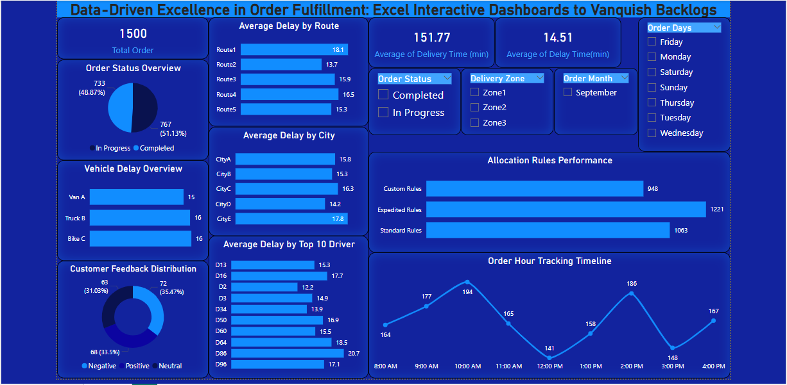
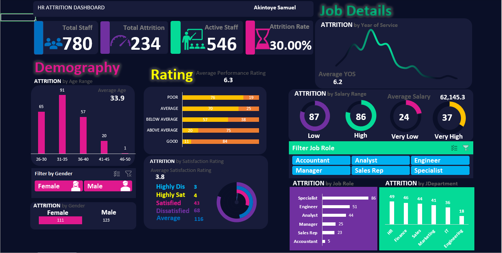

# My-Portfolio
<!--Section 1: Introduce your self-->
## ABOUT ME

Hello! I'm Akintoye Samuel 🤓, a data analyst with a passion for turning data into actionable insights. I am 
without real-life experience, i'm looking forward to working with you and build-up my skills.

<!--Mention your top/relevant skills here - core and soft skills-->
## SKILLS

**- ✅ Data Cleaning and Trnsformation.** 

**- ✅ Data Wrangling.**

**- ✅ Data Visualization and Modelling.**

<!--Section 2: List 3-4 key projects-->
## MY PORTFOLIO 

*A glimpse of some of the projects I've been working on.*

**Personal Project at Data Driven Excel: Vanquish Backlogs.**
![image]Car Sales Analysis.PNG)

Utilized Power BI to perform sentiment analysis that shows the drivers’ info, delivery delays, customers’ feedback and total order made of the delivery company.

**Beyondcars Sales Analysis/Report.**

 

Created a dashbord to hlp visualize the total number of cars sold, different car brands and models purchased.

**HR Attrition Interactive Dashboard.**

Created a dashboard on Excel & Power BI to help analyze total number of staffs, attrition rate, number of attrition and number of active staffs.

## CONTACT DETAILS

*Let’s connect and see how we can make a difference together!*
<table>
  <tbody>
    <tr>
      <td>📧</td>
      <td><a href="mailto:samuelakintoye0775@gmail.com">samuelakintoye0775@gmail.com@gmail.com</a></td>
    </tr>
    <tr>
      <td>📞</td>
      <td>(234) 704-476-0775</td>
    </tr>
    <tr>
      <td>📍</td>
      <td>Lagos, Nigeria</td>
    </tr>
    <tr>
      <td>⬇️</td>
      <td><a href="Resume-1.docx">Download my CV</a></td>
    </tr>
    <tr>
      <td>🌐</td>
      <td><a href="https://www.linkedin.com/in/samuel-akintoye-62505b329/">The things I do daily on LinkedIn</a></td>
    </tr>
  </tbody>
</table>

   

